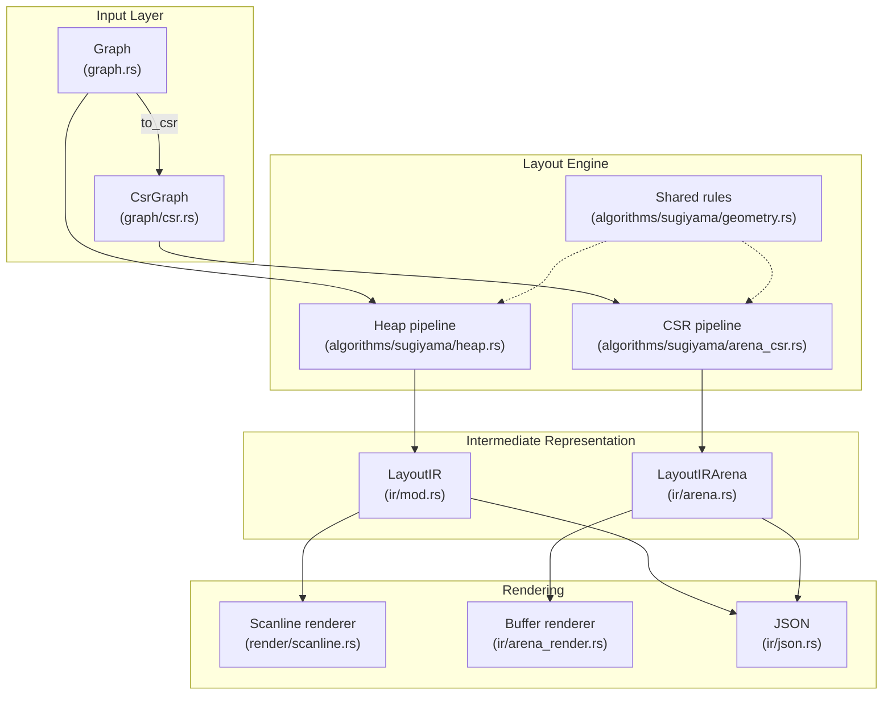

# Architecture

This document describes the internal architecture of `ascii-dag`, a zero-dependency ASCII DAG rendering library optimized for embedded and WASM environments.

## Overview



**The parity rule:** the two layout pipelines implement the same algorithm over
different type systems (heap `Vec`/`HashMap` vs arena slices/`Idx`). Every
spacing or routing rule they share lives in `algorithms/sugiyama/geometry.rs` —
defining one locally in a backend is a bug, because the copies can silently
drift. Cross-backend tests in `tests/layout_output.rs` pin IR geometry and
byte-identical rendered text between the two.

## Module Reference

### Core Data Structures

| Module | Purpose | Key Types |
|--------|---------|-----------|
| `graph.rs` | Core graph representation | `Graph<'a>`, `Direction`, `RenderMode`, `Subgraph` |
| `graph/csr.rs` | Compressed Sparse Row format | `CsrGraph<'a>`, `CsrGraphBuilder` |
| `graph/arena.rs` | Bump allocator for no_std | `Arena<'a>` |

### Layout Pipeline

| Module | Purpose |
|--------|---------|
| `algorithms/sugiyama.rs` | Level assignment, connected components |
| `algorithms/sugiyama/heap.rs` | Heap-based pipeline (`compute_layout_cfg`) |
| `algorithms/sugiyama/arena_csr.rs` | Arena/CSR pipeline (`compute_layout_arena_csr`) |
| `algorithms/sugiyama/geometry.rs` | Shared spacing/routing rules for both backends |
| `algorithms/sugiyama/config.rs` | `LayoutConfig` presets (`fast`/`standard`/`quality`) |
| `algorithms/sugiyama/crossing.rs` | `CrossingReducer` pipeline (median, adjacent exchange) |
| `algorithms/sugiyama/subgraph.rs` | Cluster passes (blocks, padding, bounding boxes) |
| `algorithms/sugiyama/idx.rs` | Configurable index types (`arena` feature) |
| `algorithms/cycles*` | Cycle detection; `algorithms/generic*`: traversal, metrics, impact |

### Intermediate Representation

| Module | Purpose | Key Types |
|--------|---------|-----------|
| `ir/mod.rs` | Heap-based IR | `LayoutIR`, `LayoutNode`, `LayoutEdge`, `EdgePath`, `SubgraphInfo` |
| `ir/arena.rs` | Arena-based IR | `LayoutIRArena`, `LayoutNodeArena`, `LayoutEdgeArena` |
| `ir/arena_builder.rs` | Arena IR construction | `LayoutIRArenaBuilder` |
| `ir/json.rs` | zigraph-compatible JSON for both IRs | `to_json()`, `serialize_json()` |

### Rendering

| Module | Purpose | Key Functions |
|--------|---------|---------------|
| `render/scanline.rs` | Heap scanline renderer | `render_scanline*` family |
| `ir/arena_render.rs`, `ir/arena_colored.rs` | Zero-alloc buffer renderers | `render_to_buffer()` |
| `render/ascii.rs` | `Graph::render()` entry, cycle banner, chain shortcut | `render()`, `render_to()` |
| `render/chars.rs`, `render/colors.rs` | Shared glyphs, junction merging, palettes | `merge_chars()`, `to_dashed()` |

---

## Data Flow

### Heap Path (default)
```text
Graph::from_edges() → Graph
    ↓
graph.compute_layout() → LayoutIR        (or compute_layout_with_config)
    ↓
layout_ir.render_scanline() → String
```

### Arena Path (embedded/no_std)
```text
Graph → graph.to_csr(&mut csr_arena) → CsrGraph
    ↓
csr.compute_layout_arena(&config, &mut temp_arena, &mut out_arena)
    ↓
Result<LayoutIRArena, GraphError>
    ↓
ir.render_to_buffer(&mut bytes, &mut line_buffer, &mut scratch)
    ↓
&[u8] (zero allocations)
```

---

## Layout Algorithm (Sugiyama)

The library implements a **pragmatic Sugiyama** algorithm; both backends run
the same stages:

### 1. Cycle Breaking
- Three-color DFS detects back edges; they are treated as reversed for
  layering and routing, and marked `reversed: true` in the IR (rendered
  dashed). `CycleBreaking::None` asserts acyclicity instead.

### 2. Level Assignment
- **Algorithm**: Iterative longest-path, O(V + E)
- Each node's level = 1 + max(parent levels), back edges reversed

### 3. Dummy Node Insertion
- Skip-level edges get a dummy at each intermediate level; dummies take part
  in crossing reduction and x-packing. They surface in the IR only when
  `LayoutConfig.include_dummy_nodes` is set (with an `edge_index` back-link).

### 4. Crossing Reduction
- Composable `CrossingReducer` pipeline: `Median(n)` and
  `AdjacentExchange(n)` passes, down-sweep then up-sweep each
- Presets: `FAST`, `STANDARD`, `QUALITY` (see `config.rs`)

### 5. X-Coordinate Assignment
- Left-to-right packing with `node_spacing` (default 3); per-level centering
- With subgraphs: block partitioning, boundary padding, iterative median
  refinement and cluster compaction

### 6. Edge Routing
- **Direct**: aligned nodes; **Corner**: one bend; **MultiSegment**: through
  jogging waypoints (straight pass-throughs collapse to verticals)
- Per-level routing rows come from shared rules in `geometry.rs`: corner
  slots, a per-level label row (only where a labeled edge is sourced), a
  bend row under the deepest waypoint, and *arrow-cell reservation* — a
  reversed edge's `⇡` cell is pre-occupied in the slot allocator so no
  horizontal run crosses an arrowhead

### 7. Rank Direction
- `Direction` (TB/BT/LR/RL) is recorded on the IR. For `BottomUp`, both
  backends flip the finished layout in place so **IR coordinates are always
  physical** — they match rendered cells. The built-in renderers currently
  paint `TopDown` only; direction-aware painting arrives with the renderer
  rework.

---

## Memory Optimization

### Index Types (Feature Flags)
```toml
# Choose based on max graph size:
arena-idx-u8   # Max 255 nodes, 1 byte per index
arena-idx-u16  # Max 65,535 nodes, 2 bytes per index
arena-idx-u32  # Max 4B nodes, 4 bytes per index (default)
```

### Arena Allocator
- Bump allocation: O(1) alloc, no free; single caller-provided block
- Capacity comes from `estimate_*` functions **before** layout begins —
  the reported buffer sizes are provisioned capacity, not touched bytes
- Used for all temporaries in the CSR layout pipeline

### Packed VNode Encoding
- Virtual nodes (real-or-dummy) are packed into `Idx` pairs behind the
  `vnode_kind` / `vnode_payload` / `vnode_set` accessors in `arena_csr.rs`

### BitSet for Booleans
- 64 booleans per `u64`, used in render buffers

---

## Feature Flags

| Feature | Effect |
|---------|--------|
| `std` (default) | `std::collections::HashMap` and friends |
| `generic` (default) | Generic algorithms (implies `alloc`) |
| `arena` | Arena/CSR layout path for `no_std` |
| `arena-idx-u8/u16/u32` | Index width selection |
| `warnings` | Debug warnings for auto-created nodes |

---

## Testing Strategy

- **Unit tests**: in each module (`#[cfg(test)]`)
- **Rendered-output tests**: `tests/layout_output.rs` asserts on the text a
  user sees, in both backends, plus a golden snapshot of the hero example
- **Cross-backend parity tests**: same graph ⇒ identical IR geometry and
  byte-identical rendered text across heap and CSR; BottomUp IRs must be
  exact vertical mirrors of TopDown
- **Fuzz targets**: `fuzz/fuzz_targets/`; **Miri** / **cargo-careful** for
  unsafe-code validation

---

## Performance Characteristics

| Operation | Complexity | Notes |
|-----------|------------|-------|
| Node/edge insertion | O(1) amortized | HashMap lookup / adjacency list |
| Cycle detection | O(V + E) | Early termination |
| Level assignment | O(V + E) | Iterative fixed-point |
| Crossing reduction | O(passes × N log N) | Per level |
| Self-loop flags | O(E) | Single pre-pass |
| Rendering | O(cells painted) | Scanline with Y-index / active-edge list |

Run `cargo run --release --example stress_test --features arena` (and with
`-- --csr`) for current numbers on your machine. Known hot spot, tracked
for the renderer rework: extreme fan-in repaints heavily overlapping
horizontal spans (many edges share a few slot rows), dominating render
time on shapes like the 50k fan.
