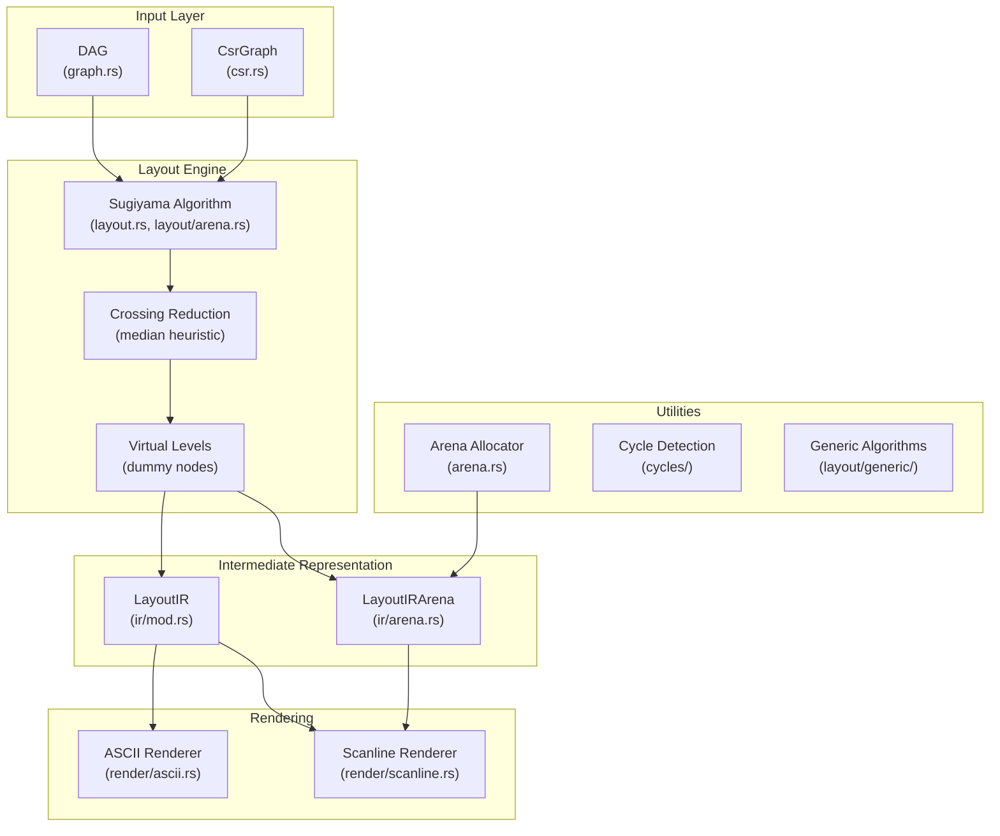

# Architecture

This document describes the internal architecture of `ascii-dag`, a zero-dependency ASCII DAG rendering library optimized for embedded and WASM environments.

## Overview



## Module Reference

### Core Data Structures

| Module | Purpose | Key Types |
|--------|---------|-----------|
| `graph.rs` | Core DAG representation | `DAG<'a>`, `RenderMode` |
| `csr.rs` | Compressed Sparse Row format | `CsrGraph<'a>`, `CsrBuilder` |
| `arena.rs` | Bump allocator for no_std | `Arena<'a>`, `ArenaVec<'a, T>` |

### Layout Pipeline

| Module | Purpose | Key Functions |
|--------|---------|---------------|
| `layout.rs` | Sugiyama algorithm entry | `calculate_levels()`, `reduce_crossings()` |
| `layout/arena.rs` | Arena-based layout | `compute_layout_arena()`, `compute_layout_arena_csr()` |
| `layout/idx.rs` | Configurable index types | `Idx` (u8/u16/u32), `Coord` |
| `layout/generic/` | Generic graph algorithms | `topological_sort_fn()`, `GraphMetrics` |

### Intermediate Representation

| Module | Purpose | Key Types |
|--------|---------|-----------|
| `ir/mod.rs` | Heap-based IR | `LayoutIR`, `LayoutNode`, `LayoutEdge`, `EdgePath` |
| `ir/arena.rs` | Arena-based IR | `LayoutIRArena`, `LayoutIRArenaBuilder` |

### Rendering

| Module | Purpose | Key Functions |
|--------|---------|---------------|
| `render/ascii.rs` | ASCII renderer entry point | `render()`, `render_to()` |
| `render/scanline.rs` | Scanline renderer | `render_scanline()`, `render_scanline_with_buffer()` |

### Utilities

| Module | Purpose | Key Functions |
|--------|---------|---------------|
| `cycles.rs` | DAG cycle detection | `has_cycle()` |
| `cycles/generic.rs` | Generic cycle detection | `detect_cycle_fn()`, `CycleDetectable` trait |
| `cycles/generic/roots.rs` | Root finding | `find_roots_fn()` |

---

## Data Flow

### Heap Path (default)
```
DAG::from_edges() → DAG
    ↓
dag.compute_layout() → LayoutIR
    ↓
layout_ir.render_scanline() → String
```

### Arena Path (embedded/no_std)
```
DAG → dag.to_csr() → CsrGraph
    ↓
compute_layout_arena_csr(&graph, &mut temp_arena, &mut output_arena)
    ↓
LayoutIRArena
    ↓
ir.render_to_buffer(&mut bytes, &mut line_buffer)
    ↓
&[u8] (zero allocations)
```

---

## Layout Algorithm (Sugiyama)

The library implements a **pragmatic Sugiyama** algorithm:

### 1. Cycle Detection
- Uses DFS-based cycle detection (`cycles.rs`)
- Cycles are visualized explicitly, not broken via edge reversal

### 2. Level Assignment
- **Algorithm**: Iterative longest-path
- **Complexity**: O(V + E)
- Each node's level = 1 + max(parent levels)

### 3. Dummy Node Insertion
- Skip-level edges (A → C where C is level 2+) get dummy nodes
- Dummy nodes are inserted at each intermediate level
- Stored in the layout IR as node/edge records

### 4. Crossing Reduction
- **Algorithm**: Median heuristic
- **Implementation**: `order_by_median_parents()`, `order_by_median_children()`
- **Passes**: Configurable via `set_crossing_reduction_passes()` (default: 4)
- Down-sweep then up-sweep per pass

### 5. X-Coordinate Assignment
- Nodes placed left-to-right with 3-char spacing
- Per-level centering for visual balance

### 6. Edge Routing
- **Direct**: Vertically aligned nodes
- **Corner**: L-shaped with horizontal segment
- **SideChannel**: Skip-level edges routed on outer edges
- **MultiSegment**: Complex paths through waypoints

---

## Memory Optimization

### Index Types (Feature Flags)
```toml
# Choose based on max graph size:
arena-idx-u8   # Max 255 nodes, 1 byte per index
arena-idx-u16  # Max 65,535 nodes, 2 bytes per index  
arena-idx-u32  # Max 4B nodes, 4 bytes per index (default)
```

### Arena Allocator
- Bump allocation: O(1) alloc, no free
- No fragmentation
- Stack-allocatable buffer support
- Used for all temporaries in layout computation

### VirtualNode Encoding
```rust
// 8 bytes total, uses high bit as tag
const DUMMY_FLAG: usize = 1 << (usize::BITS - 1);
// Real node: index (63 bits)
// Dummy node: DUMMY_FLAG | edge_index
```

### BitSet for Booleans
- 64 booleans per u64
- 64x memory reduction vs `Vec<bool>`
- Used in render buffers

---

## Feature Flags

| Feature | Effect | Size Impact |
|---------|--------|-------------|
| `std` (default) | Enable `std::collections::HashMap` | +5KB |
| `generic` (default) | Enable generic algorithms | +10KB |
| `arena` | Enable arena-based layout | +8KB |
| `arena-idx-u8` | Use `u8` for arena indices | -2KB |
| `warnings` | Debug warnings for auto-nodes | Minimal |

---

## File Size Reference

| File | Lines | Purpose |
|------|-------|---------|
| `render/ascii.rs` | 1874 | Main ASCII renderer (largest) |
| `layout/arena.rs` | 1090 | Arena-based layout computation |
| `graph.rs` | 1018 | Core DAG structure |
| `csr.rs` | 677 | Compressed Sparse Row graph |
| `ir/mod.rs` | 422 | Intermediate representation |
| `ir/arena.rs` | 674 | Arena-based IR |

---

## Testing Strategy

- **Unit tests**: In each module (`#[cfg(test)]`)
- **Integration tests**: Examples act as integration tests
- **Fuzz targets**: `fuzz/fuzz_targets/` for security testing
- **Miri**: Memory safety validation for unsafe code
- **cargo-careful**: Extra UB detection

---

## Performance Characteristics

| Operation | Complexity | Notes |
|-----------|------------|-------|
| Node insertion | O(1) amortized | HashMap-based lookup |
| Edge insertion | O(1) amortized | Adjacency list storage |
| Cycle detection | O(V + E) | Early termination on cycle |
| Level assignment | O(V + E) | Iterative fixed-point |
| Crossing reduction | O(L × N × log N) | L=passes, N=nodes per level |
| Rendering | O(V + E) | Scanline-based |

**Benchmarks** (M2 Ultra, release mode):
- 50 nodes: ~0.2ms (arena), ~0.7ms (heap) — **3.5x speedup**
- 500 nodes: ~1.5ms (arena), ~54ms (heap) — **36x speedup**
