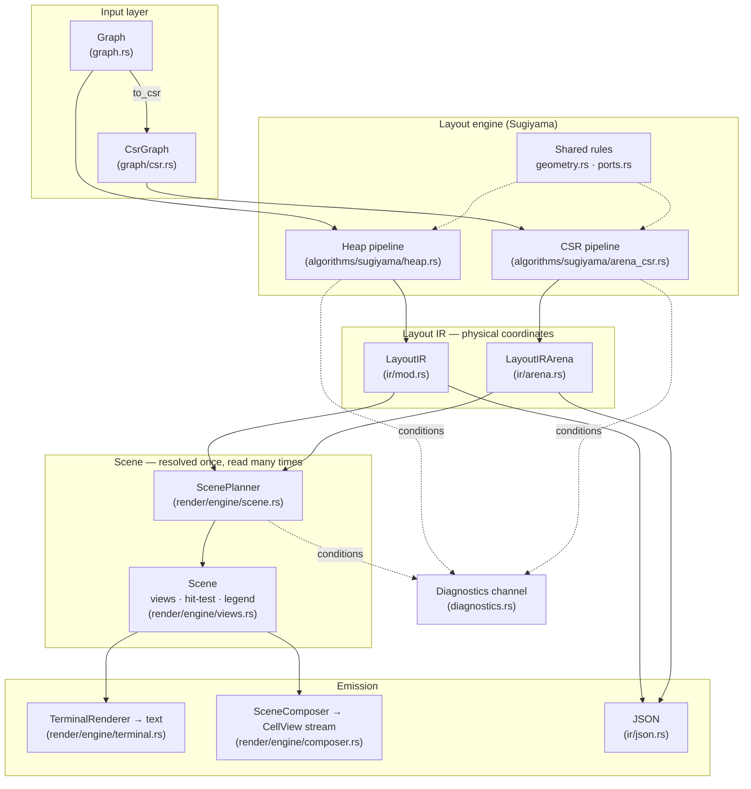

# Architecture

This document describes the internal architecture of `ascii-dag`, a zero-dependency ASCII DAG rendering library optimized for embedded and WASM environments.

## Overview



**The scene in between.** Layout produces an IR of physical
coordinates; nothing paints from it directly. A `ScenePlanner` first
resolves the IR under one `PlanOptions` into a `Scene`: every style
callback has run exactly once, every label has its slot (inline,
legend, or omitted), and the geometry is indexed. That scene is then
read as many times as needed — by `TerminalRenderer` for text under
any emission options, by `SceneComposer` for a stream of semantic
`CellView`s that an SVG or TUI consumer decodes itself, and by the
element views (`scene.nodes()`, `edges()`, `subgraphs()`, `legend()`,
`hit_test(x, y)`) that editors and exporters read — without
replanning and, in steady state, without allocating. The one-step
wrappers on both IRs (`render_string`, `render_with`,
`render_to_bytes`) are the same path run once: plan → compose → emit.

**The parity rule:** the two layout pipelines implement the same algorithm over
different type systems (heap `Vec`/`HashMap` vs arena slices/`Idx`). Every
spacing or routing rule they share lives in `algorithms/sugiyama/geometry.rs`
and, for ports, `algorithms/sugiyama/ports.rs` — defining one locally in a
backend is a bug, because the copies can silently drift. Cross-backend tests in `tests/layout_output.rs` pin IR geometry and
byte-identical rendered text between the two.

**Known bounded exception (0.10):** under extreme interleaved skip-edge
pressure (dozens of mutually crossing multi-level dummy chains), the two
backends' crossing-reduction heuristics can order dummy runs differently,
producing different — individually valid — routings. The shape is pinned
by the `#[ignore]`d `extreme_interleaved_skips_parity_frontier` test in
`tests/layout_output.rs`; parity holds everywhere else, including deep
chains, clustered deep graphs, 500+-edge late-skip graphs, and
1,000+-dummy waypoint chains.

## Module Reference

### Core Data Structures

| Module | Purpose | Key Types |
|--------|---------|-----------|
| `graph.rs` | Core graph representation | `Graph<'a>`, `Direction`, `RenderMode`, `Subgraph` |
| `graph/csr.rs` | Compressed Sparse Row format | `CsrGraph<'a>`, `CsrGraphBuilder` |
| `graph/arena.rs` | Bump allocator for no_std | `Arena<'a>` |
| `diagnostics.rs` | Typed, run-scoped diagnostics: conditions and point events as data, never stderr | `Diagnostic`, `DiagnosticKind`, `DiagnosticRun`, `DiagnosticContext`, sinks (`VecDiagnostics`, `SliceDiagnostics`, …) |
| `errors.rs` | Fatal outcomes and the stable `E.*`/`W.*` code vocabulary | `GraphError`, `ErrorChain` |
| `validation.rs` | Requirements a graph must meet before an algorithm runs | `Requirements` |

### Layout Pipeline

| Module | Purpose |
|--------|---------|
| `algorithms/sugiyama.rs` | Level assignment, connected components |
| `algorithms/sugiyama/heap.rs` | Heap-based pipeline (`compute_layout_cfg`) |
| `algorithms/sugiyama/arena_csr.rs` | Arena/CSR pipeline (`compute_layout_arena_csr`) |
| `algorithms/sugiyama/geometry.rs` | Shared spacing/routing rules for both backends |
| `algorithms/sugiyama/ports.rs` | Side ports (`ports` feature): the side vocabulary, per-face placement under a `PortPolicy`, detour lanes and their arena budget, attachment resolution — one set of rules both backends call |
| `algorithms/sugiyama/config.rs` | `LayoutConfig` presets (`fast`/`standard`/`quality`) |
| `algorithms/sugiyama/crossing.rs` | `CrossingReducer` pipeline (median, adjacent exchange) |
| `algorithms/sugiyama/subgraph.rs` | Cluster passes (blocks, padding, bounding boxes) |
| `algorithms/sugiyama/idx.rs` | Configurable index types (`arena` feature) |
| `algorithms/cycles*` | Cycle detection; `algorithms/generic*`: traversal, metrics, impact |

### Intermediate Representation

| Module | Purpose | Key Types |
|--------|---------|-----------|
| `ir/mod.rs` | Heap-based IR | `LayoutIR`, `LayoutNode`, `LayoutEdge`, `EdgePath`, `SubgraphInfo` |
| `ir/arena.rs` | Arena-based IR | `LayoutIRArena`, `LayoutNodeArena`, `LayoutEdgeArena` |
| `ir/arena_builder.rs` | Arena IR construction | `LayoutIRArenaBuilder` |
| `ir/json.rs` | zigraph-compatible JSON for both IRs | `to_json()`, `serialize_json()` |

### Rendering

One engine serves both IRs — the render layer has no "backends" (`LayoutView`
lens over either IR, monomorphized). It runs in three stages:

1. **Plan** — `ScenePlanner::plan(&ir, &PlanOptions)` resolves the IR into a
   `Scene` (`PlanRun` is diagnostic-aware: `.compute(&mut cx)`,
   `.reported()`, `.quiet()`). Styles, label slots, the legend, and a
   spatial index are settled here, once.
2. **Compose** — semantic cells (tagged `u32`: text / stroke arms / marker)
   paint on a band-sized canvas from the scene's geometry. An edge's
   `flow_axis` selects the formulas, its coordinates the sign; the
   `Direction` enum is never consulted at paint time. `SceneComposer`
   exposes the composed cells as decoded `CellView`s.
3. **Emit** — a charset table decodes the cells at emission, so Unicode and
   ASCII are equal projections of one canvas; `TerminalRenderer` writes
   the bands to any `core::fmt::Write` or a byte buffer.

| Module | Purpose | Key items |
|--------|---------|-----------|
| `render/engine/scene.rs` | Plan once: the resolved scene and its diagnostic-aware run | `ScenePlanner`, `PlanRun`, `Scene` |
| `render/engine/views.rs` | Storage-neutral, read-only element views over a scene, identical across backends | `NodeView`, `EdgeView`, `EdgePathView`, `LabelView`, `SubgraphView`, `Scene::{nodes, edges, subgraphs, legend}` |
| `render/engine/view.rs` | The one lens the engine is generic over | `LayoutView` |
| `render/engine/terminal.rs` | Retained terminal emission over a scene: many emissions, one plan | `TerminalRenderer::{render, render_into}` |
| `render/engine/composer.rs` | Cell answers for non-terminal consumers; the composition sizing contract | `SceneComposer::visit_cells`, `CompositionRequirements` |
| `render/engine/cells.rs` | The public cell vocabulary: decoded views, never packed internals | `CellView`, `CellKind`, `CellMarker`, `ArmWeights` |
| `render/engine/plan.rs` | Per-element styles, label placement, band partition, spatial index — the plan behind a scene | `RenderPlan` |
| `render/engine/compose.rs` | Band compositor, geometry-driven paint, span dedup | `BandCanvas`, `PaintScratch` |
| `render/engine/owner.rs` | The ownership plane behind hit-testing and `CellView.owner` | — |
| `render/engine/emit.rs` | Charset decode, color escapes, byte sink, legend | `ByteSink` |
| `render/engine/api.rs` | One-step wrappers and the sizing estimators on both IRs | `render_with`, `render_string`, `render_to_bytes`, `estimate_render_arena_size`, `estimate_scene_size` |
| `render/engine/node_content.rs`, `region.rs` | Nodes as objects; the clipped writer custom painters draw through | `NodeContent`, `BoxedNode`, `CustomNode`, `NodeRegion` |
| `render/engine/cell.rs`, `color.rs`, `charset/` | Semantic cells, packed colors, decode tables | `Cell`, `CellColor`, `Charset` |
| `render/engine/style.rs`, `presets.rs`, `config.rs` | Styling vocabulary, const presets, options in three homes | `RenderOptions { plan, emit, compose }`, `EdgeStyle`, … |
| `render/engine/mem.rs` | Heap-or-arena buffer shape behind the no-alloc path | `PlanBuf` |
| `render/engine/parity.rs` | The engine invariants suite (tests) | — |
| `render/ascii.rs` | `Graph::render()` facade: cycle banner, chain shortcut | `render()`, `render_to()` |
| `render/chars.rs`, `render/colors.rs` | Box-drawing utilities, palettes | `mask_to_char()`, `Palette` |

Rendering is **banded**: the canvas holds `width × min(band_rows_cap, height)`
cells regardless of graph height, bands stream to any `core::fmt::Write`, and
overlapping horizontal spans paint as merged runs (one write per final cell).
The no-alloc story is three exact contracts: `ir.estimate_scene_size(&plan)`
sizes a `ScenePlanner::new_in` workspace, `scene.composition_requirements(&compose)`
sizes the composer or terminal workspace, and the renderer's
`estimate_output_size(&emit)` bounds the bytes.

---

## Data Flow

### Heap Path (default)
```text
Graph::from_edges() → Graph
    ↓
graph.compute_layout() → LayoutIR        (or graph.layout().reported() for the
    ↓                                     run's diagnostics alongside the IR)
one step:   ir.render_string(&RenderOptions::plain()) → String
            (or .render_with(&options, &mut impl fmt::Write) to stream)
or, plan once and read many:
    ScenePlanner::new().plan(&ir, &options.plan).quiet()? → Scene
        ↓
    TerminalRenderer::new(&options.emit, scene.composition_requirements(&options.compose))
        .render(&scene, &mut out)                 text, any emission options
    SceneComposer::visit_cells(&scene, |cell| …)  semantic cells for SVG / TUI
    scene.nodes() / edges() / hit_test(x, y)     views for editors and exporters
```

### Arena Path (embedded/no_std)
```text
Graph → graph.to_csr(&mut csr_arena) → CsrGraph     (or CsrGraphBuilder directly)
    ↓
csr.compute_layout_arena(&config, &mut temp_arena, &mut out_arena)
    (or compute_layout_arena_reporting(…, &mut diagnostics) for the run's conditions)
    ↓
Result<LayoutIRArena, GraphError>
    ↓
ir.render_to_bytes(&options, &arena, &mut bytes)
    ↓  (arena sized by ir.estimate_render_arena_size(&options),
        bytes by ir.estimate_render_output_size(&options))
Result<usize, GraphError> → &bytes[..n] (zero allocations)

The scene stages run out of caller slices too: ScenePlanner::new_in(workspace)
sized by ir.estimate_scene_size(&plan), TerminalRenderer::new_in / SceneComposer::new_in
sized by scene.composition_requirements(&compose).
```

---

## Layout Algorithm (Sugiyama)

The library implements a **pragmatic Sugiyama** algorithm; both backends run
the same stages:

### 1. Cycle Breaking
- Three-color DFS detects back edges; they are treated as reversed for
  layering and routing, and marked `reversed: true` in the IR (rendered
  dashed). `CycleBreaking::None` asserts acyclicity instead.

### 2. Level Assignment
- **Algorithm**: Iterative longest-path, O(V + E)
- Each node's level = 1 + max(parent levels), back edges reversed

### 3. Dummy Node Insertion
- Skip-level edges get a dummy at each intermediate level; dummies take part
  in crossing reduction and x-packing. They surface in the IR only when
  `LayoutConfig.include_dummy_nodes` is set (with an `edge_index` back-link).

### 4. Crossing Reduction
- Composable `CrossingReducer` pipeline: `Median(n)` and
  `AdjacentExchange(n)` passes, down-sweep then up-sweep each
- Presets: `FAST`, `STANDARD`, `QUALITY` (see `config.rs`)

### 5. Cross-Axis Assignment
Packing along the CROSS axis with `node_spacing` (default 3), plus
per-level centering. Which physical axis that is comes from the
direction: columns for TB/BT, rows for LR/RL (see §7).
- With subgraphs: block partitioning, boundary padding, iterative median
  refinement and cluster compaction

### 6. Edge Routing
- **Direct**: aligned nodes; **Corner**: one bend; **MultiSegment**: through
  jogging waypoints (straight pass-throughs collapse to plain flow runs)
- Every level reserves a routing band along the LEVEL axis — rows below
  the nodes in TB/BT, columns beside them in LR/RL — sized by shared
  rules in `geometry.rs`: corner slots, a per-level label line (only
  where a labeled edge is sourced), a bend line past the deepest
  waypoint, and *arrow-cell reservation*, which pre-occupies a reversed
  edge's arrowhead cell in the slot allocator so no cross-cutting run
  crosses an arrowhead
- Each edge records the physical axis its trunk runs along
  (`flow_axis`); paint, hit-testing, and label placement read it rather
  than guessing from endpoints, which is ambiguous for corner edges

### 7. Port Attachment (`ports` feature)
- Each edge end may declare a side: a compass point (`North`…), a
  flow-relative face (`Upstream` / `Downstream`), or a rotation of the
  flow (`Clockwise` / `Counterclockwise`). Sides resolve per frame into
  faces in ROLE space — the arrive face, the leave face, the two side
  faces — and bind to the DECLARED endpoints, so a cycle reversal never
  moves a port.
- Where on a face an end lands is the node's `PortPolicy`: `Single`
  (one shared port per face, the default and the `Auto` drawing),
  `Paired` (an arrival port and a departure port), `Spread` (up to a
  bound), or `Custom` (the placer registered on the graph). A face
  with one cell holds one port whatever the policy.
- A side on the flow's own face is head-on and costs nothing. A side
  against the flow routes around the node, a side face through a stub
  beside it: both use a lane in the packing gap (never a node cell,
  another edge's trunk or lane) and slot rows above or below the node,
  and emit an explicit `EdgePath::Orthogonal` polyline. No lane means
  head-on after all — and a `W.Graph.Port.035` condition; a side on a
  self-loop is deferred with `W.Graph.Port.034`.
- Every IR edge reports both ends' attachments (`from_port` /
  `to_port`: requested side, physical side). The arena pipeline sizes
  its detour scratch from a budget computed before allocation
  (`ports::detour_budget`), so a port-free layout pays nothing.

### 8. Rank Direction
- `Direction` (TB/BT/LR/RL) is recorded on the IR and drives layout.
  One pipeline serves all four: it computes in ROLE space (a level
  axis and a cross axis) and an axis profile — a zero-sized type,
  monomorphized away — says which physical axis each role maps to.
  `TopDown`/`BottomUp` make levels rows; `LeftRight`/`RightLeft` make
  them columns. Coordinates materialize to `(x, y)` at IR emission.
- The mirrored directions are flips of the finished layout, in place
  and pre-build: `BottomUp` on y, `RightLeft` on x. **IR coordinates
  are always physical** — they match rendered cells.
- Every edge carries a `flow_axis` (`Y` or `X`) naming the physical
  axis its trunk runs along; paint, hit-testing, and label placement
  select their formulas from it. Flow SIGN still derives from
  coordinates, and the enum is never consulted at paint time.

---

## Memory Optimization

### Index Types (Feature Flags)
```toml
# Choose based on max graph size:
arena-idx-u8   # Max 255 nodes, 1 byte per index
arena-idx-u16  # Max 65,535 nodes, 2 bytes per index
arena-idx-u32  # Max 4B nodes, 4 bytes per index (default)
```

### Arena Allocator
- Bump allocation: O(1) alloc, no free; single caller-provided block
- Capacity comes from `estimate_*` functions **before** layout begins —
  the reported buffer sizes are provisioned capacity, not touched bytes
- Used for all temporaries in the CSR layout pipeline

### Packed VNode Encoding
- Virtual nodes (real-or-dummy) are packed into `Idx` pairs behind the
  `vnode_kind` / `vnode_payload` / `vnode_set` accessors in `arena_csr.rs`

### BitSet for Booleans
- 64 booleans per `u64`, used in render buffers

---

## Feature Flags

| Feature | Effect |
|---------|--------|
| `std` (default) | Standard library; implies `alloc` |
| `alloc` | Heap `Graph` API without `std` (needs a global allocator) |
| `generic` (default) | Generic algorithms over caller types (implies `std`) |
| `layout-vertical` / `layout-horizontal` (default) | The axis profiles: TB/BT and LR/RL; at least one is required |
| `ports` (default) | Declared edge attachment sides, port policies, and their routing; off, nothing of it is linked |
| `arena` | Arena/CSR layout path for `no_std` |
| `arena-idx-u8/u16/u32` | Index width selection |

---

## Testing Strategy

- **Unit tests**: in each module (`#[cfg(test)]`)
- **Rendered-output tests**: `tests/layout_output.rs` asserts on the text a
  user sees, in both backends, plus a golden snapshot of the hero example
- **Cross-backend parity tests**: same graph ⇒ identical IR geometry and
  byte-identical rendered text across heap and CSR, in every direction,
  on exactly estimate-sized arenas
- **Direction tests**: the mirrored directions must be exact mirrors of
  their counterparts — `BottomUp` of `TopDown` on y, `RightLeft` of
  `LeftRight` on x — asserted field by field against a mirror computed
  independently in the test. A corpus of graphs is then run through the
  full ladder in both horizontal orientations: geometric invariants
  (ports on node faces, no overlaps, boxes containing their members),
  a glyph⇄hit sweep proving no painted cell is orphaned, and
  band-cap invariance
- **Engine invariants** (`render/engine/parity.rs`): every corpus graph's
  scene, cells, views, and hit-test agree across backends, band caps,
  and charsets; explicit polylines and attachments included
- **Port routing pins** (`algorithms/sugiyama/ports.rs` test modules):
  detour fixtures in every direction on both backends from exactly
  estimated arenas, routing invariants (no ink inside nodes, no
  unrelated runs merged), and a wide-star budget bound
- **Diagnostics** (`tests/diagnostics.rs`): conditions report and clear
  identically through the heap run and the arena reporting entry
- **Fuzz targets**: `fuzz/fuzz_targets/`; **Miri** / **cargo-careful** for
  unsafe-code validation

---

## Performance Characteristics

| Operation | Complexity | Notes |
|-----------|------------|-------|
| Node/edge insertion | O(1) amortized | HashMap lookup / adjacency list |
| Cycle detection | O(V + E) | Early termination |
| Level assignment | O(V + E) | Iterative fixed-point |
| Crossing reduction | O(passes × N log N) | Per level |
| Self-loop flags | O(E) | Single pre-pass |
| Rendering | O(cells painted) | Scanline with Y-index / active-edge list |

Run `cargo run --release --example stress_test --features arena` (and with
`-- --csr`) for current numbers on your machine. Known hot spot, tracked
for the renderer rework: extreme fan-in repaints heavily overlapping
horizontal spans (many edges share a few slot rows), dominating render
time on shapes like the 50k fan.
