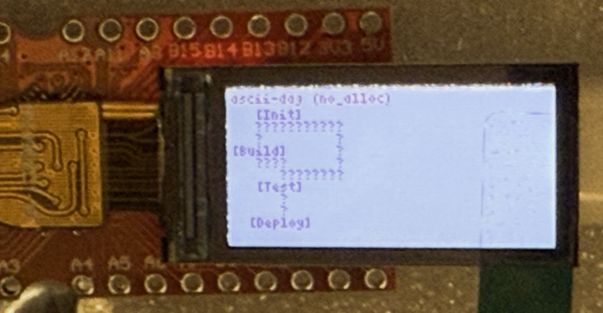

# ascii-dag

[](https://crates.io/crates/ascii-dag)
[](https://docs.rs/ascii-dag)
[](LICENSE)

Graph layout engine. Zero dependencies. `no_std` ready.


> *Nested subgraphs, edge labels, reversed edges (┊ dashed), self-cycle, skip-level routing, colored edges — all from ~35 lines of Rust.*
> Run it: `cargo run --example hero` (plain) or `cargo run --example hero -- --color` (ANSI colors + legend)

**ascii-dag** is a high-performance **layout engine** for placing nodes and routing edges in a fixed-width grid.

## Why?
- **Zero Dependencies**: Drop it into any `no_std`, WASM, or embedded project.
- **Visual Error Chains**: Show users *why* their build failed (Cycle detected? Dependency missing?).
- **Fast**: ~4ms for 200-node diamond, ~9ms for 500-node fan (heap)

## Features
- **Tiny**: ~39KB WASM (arena), ~93KB (full) — after `wasm-opt -Oz`
- **Fast**: Sugiyama layout with configurable crossing reduction
- **Headless**: Layout IR for custom renderers (Canvas, SVG, TUI)
- **Robust**: Handles diamonds, cycles, skip-level edges
- **Embedded**: `no_std`, no-alloc (Arena mode)
- **Colored Edges**: Up to 8 colors with automatic greedy coloring
- **Edge Labels**: Inline labels displayed along edge paths
- **Subgraphs / Clusters**: Group nodes into labeled, nestable double-line boxes
- **Configurable Pipeline**: `SugiyamaConfig` with presets (`fast`, `standard`, `quality`) or full custom control

## Use Cases

**Tool Authors**
- Error diagnostics ("Circular dependency in module X")
- Build systems (task execution graphs)
- Package managers (dependency trees with diamonds)

**Systems Engineers**
- Data pipelines (ETL, Airflow DAGs)
- Distributed systems (request tracing)

**Embedded & Web**
- IoT consoles (state machines on devices with no display)
- Headless rendering (Canvas/SVG from Layout IR)

## Alternatives Comparison

| Feature | ascii-dag | petgraph | Graphviz (dot) |
|---|---:|:---:|:---:|
| Primary Goal | Visualization (Terminal) | Algorithms (Shortest Path, etc.) | Visualization (Image / SVG / PDF) |
| Dependencies | 0 (Zero) | Minimal | Heavy (binary / C libs) |
| WASM Size | **~47 - 77 KB** | ~30 KB | 2 MB+ (via Viz.js) |
| Layout Engine | Built-in (Sugiyama) | None (manual positioning) | Built-in (advanced, many options) |
| Environment | Terminal / Web / Headless | Code / Logic | Desktop / Web |

Use ascii-dag when you want compact, zero-dependency terminal visualization with a built-in layout engine. For heavy graph algorithms use `petgraph`; for high-fidelity image output and advanced layout options, use Graphviz.

## Quick Start

### Graph Rendering

```rust
use ascii_dag::Graph;

fn main() {
    let dag = Graph::from_edges(
        &[(1, "Error1"), (2, "Error2"), (3, "Error3")],
        &[(1, 2), (2, 3)]
    );

    println!("{}", dag.render());
}
```

Output:
```
  [Error1]
   │
   ↓
  [Error2]
   │
   ↓
  [Error3]
```

### Generic Cycle Detection

Detect cycles in **any data structure** using higher-order functions:

```rust
use ascii_dag::algorithms::cycles::generic::detect_cycle_fn;

let get_deps = |package: &str| match package {
    "app" => vec!["lib-a", "lib-b"],
    "lib-a" => vec!["lib-c"],
    "lib-b" => vec!["lib-c"],
    "lib-c" => vec![],
    _ => vec![],
};

let packages = ["app", "lib-a", "lib-b", "lib-c"];
if let Some(cycle) = detect_cycle_fn(&packages, get_deps) {
    panic!("Circular dependency: {:?}", cycle);
} else {
    println!("✓ No cycles detected");
}
```

## Usage

### Builder API (Dynamic Construction)

```rust
use ascii_dag::Graph;

let mut dag = Graph::new();

dag.add_node(1, "Parse");
dag.add_node(2, "Compile");
dag.add_node(3, "Link");

dag.add_edge(1, 2, None);  // Parse -> Compile
dag.add_edge(2, 3, None);  // Compile -> Link

println!("{}", dag.render());
```

### Batch Construction (Static, Fast)

```rust
use ascii_dag::Graph;

let dag = Graph::from_edges(
    &[(1, "A"), (2, "B"), (3, "C"), (4, "D")],
    &[(1, 2), (1, 3), (2, 4), (3, 4)]  // Diamond!
);

println!("{}", dag.render());
```

Output:
```text
   [A]
    │
 ┌─────┐
 ↓     ↓
[B]   [C]
 │     │
 └─────┘
    ↓
   [D]
```

### Zero-Copy Rendering

```rust
let dag = Graph::from_edges(/* ... */);
let mut buffer = String::with_capacity(dag.estimate_size());
dag.render_to(&mut buffer);  // No allocation!
```

### Subgraphs (Clusters)

Group nodes into labeled, double-line bordered boxes (`╔═╗║╚═╝`).
Subgraphs can be nested and the layout engine automatically handles
padding and border rendering.

```rust
use ascii_dag::Graph;
use ascii_dag::RenderOptions;

let mut g = Graph::new();
g.add_node(1, "Web");
g.add_node(2, "API");
g.add_node(3, "DB");
g.add_node(4, "Cache");

g.add_edge(1, 2, None);
g.add_edge(2, 3, None);
g.add_edge(2, 4, None);

// Create clusters
let frontend = g.add_subgraph("Frontend");
g.put_nodes(&[1]).inside(frontend).unwrap();

let backend = g.add_subgraph("Backend");
g.put_nodes(&[2, 3, 4]).inside(backend).unwrap();

let ir = g.compute_layout();
println!("{}", ir.render_string(&RenderOptions::plain()));
```

Features:
- **Double-line borders** (`╔═╗║╚═╝`) visually distinct from edges
- **Label-inside rendering** — cluster label sits inside the top border
- **Junction characters** (`╤ ╧ ╪ ╫ ╞ ╡`) where edges cross borders
- **Nested clusters** — `put_subgraphs(&[child]).inside(parent)`
- **Depth-aware padding** — sibling and nested clusters never overlap

### Configurable Layout Pipeline

Control every stage of the Sugiyama algorithm via `SugiyamaConfig`:

```rust
use ascii_dag::{Graph, SugiyamaConfig};
use ascii_dag::algorithms::sugiyama::crossing::CrossingReducer;

let dag = Graph::from_edges(
    &[(1, "A"), (2, "B"), (3, "C")],
    &[(1, 2), (2, 3)]
);

// Use a curated preset
let ir = dag.compute_layout_with(&SugiyamaConfig::quality());

// Or build a fully custom config
use ascii_dag::{CycleBreaking, Layering, Positioning, RenderMode};

let cfg = SugiyamaConfig {
    cycle_breaking: CycleBreaking::DepthFirst,
    layering: Layering::LongestPath,
    crossing_pipeline: vec![
        CrossingReducer::Median(6),
        CrossingReducer::AdjacentExchange(2),
    ],
    positioning: Positioning::Compact,
    render_mode: RenderMode::Auto,
};

let ir = dag.compute_layout_with(&cfg);
```

**Presets:**

| Preset | Crossing Pipeline | Best For |
|--------|------------------|----------|
| `SugiyamaConfig::fast()` | Median(2) | Large graphs, speed priority |
| `SugiyamaConfig::standard()` | Median(4) → AdjExch(2) | Balanced quality/speed (default) |
| `SugiyamaConfig::quality()` | Median(8) → AdjExch(4) → Median(2) | Complex, tangled graphs |

### Colored Edges

Render edges with distinct colors to visualize different dependency types:

```rust
use ascii_dag::Graph;
use ascii_dag::render::colors::Palette;
use ascii_dag::RenderOptions;

let dag = Graph::from_edges(
    &[(1, "Root"), (2, "A"), (3, "B"), (4, "C"), (5, "End")],
    &[(1, 2), (1, 3), (1, 4), (2, 5), (3, 5), (4, 5)]
);

let ir = dag.compute_layout();
let output = ir.render_string(&RenderOptions::colored(Palette::Ansi));
println!("{}", output);
```

### Edge Labels

Add labels to edges to describe relationships:

```rust
use ascii_dag::Graph;
use ascii_dag::render::colors::Palette;
use ascii_dag::RenderOptions;

let mut dag = Graph::new();
dag.add_node(1, "Parser");
dag.add_node(2, "Lexer");
dag.add_node(3, "AST");

dag.add_edge(1, 2, Some("uses"));
dag.add_edge(1, 3, Some("produces"));
dag.add_edge(2, 3, None);

let ir = dag.compute_layout();
let output = ir.render_string(&RenderOptions::colored(Palette::Ansi));
println!("{}", output);
```

### Cycle Handling

Graphs with cycles are handled automatically — back edges are detected
via DFS and temporarily reversed for layout, then marked `reversed: true`
in the output IR:

```rust
use ascii_dag::Graph;
use ascii_dag::RenderOptions;

let mut dag = Graph::new();
dag.add_node(1, "A");
dag.add_node(2, "B");
dag.add_node(3, "C");

dag.add_edge(1, 2, None);
dag.add_edge(2, 3, None);
dag.add_edge(3, 1, None);  // Cycle!

// has_cycle() for validation
assert!(dag.has_cycle());

// But layout still works — cycles are broken automatically
let ir = dag.compute_layout();
println!("{}", ir.render_string(&RenderOptions::plain()));
```

### Generic Cycle Detection for Custom Types

Use the trait-based API for cleaner code:

```rust
use ascii_dag::algorithms::cycles::generic::CycleDetectable;

struct ErrorRegistry {
    errors: HashMap<usize, Error>,
}

impl CycleDetectable for ErrorRegistry {
    type Id = usize;

    fn get_children(&self, id: &usize) -> Vec<usize> {
        self.errors.get(id)
            .map(|e| e.caused_by.clone())
            .unwrap_or_default()
    }
}

// Now just call:
if registry.has_cycle() {
    panic!("Circular error chain detected!");
}
```

### Root Finding & Impact Analysis

```rust
use ascii_dag::algorithms::cycles::generic::roots::find_roots_fn;
use ascii_dag::algorithms::generic::impact::compute_descendants_fn;

let get_deps = |pkg: &&str| match *pkg {
    "app" => vec!["lib-a", "lib-b"],
    "lib-a" => vec!["core"],
    "lib-b" => vec!["core"],
    "core" => vec![],
    _ => vec![],
};

let packages = ["app", "lib-a", "lib-b", "core"];

// Find packages with no dependencies (can build first)
let roots = find_roots_fn(&packages, get_deps);
// roots = ["core"]

// What breaks if "core" changes?
let impacted = compute_descendants_fn(&packages, &"core", get_deps);
// impacted = ["lib-a", "lib-b", "app"]
```

### Graph Metrics

```rust
use ascii_dag::algorithms::generic::metrics::GraphMetrics;

let metrics = GraphMetrics::compute(&packages, get_deps);
println!("Total packages: {}", metrics.node_count());
println!("Dependencies: {}", metrics.edge_count());
println!("Max depth: {}", metrics.max_depth());
println!("Avg dependencies: {:.2}", metrics.avg_dependencies());
println!("Is tree: {}", metrics.is_tree());
```

## Supported Patterns

### Simple Chain
```text
[A] → [B] → [C]
```

### Diamond (Convergence)
```text
   [A]
    │
 ┌─────┐
 ↓     ↓
[B]   [C]
 │     │
 └─────┘
    ↓
   [D]
```

### Variable-Length Paths
```text
     [Root]
        │
   ┌─────────┐
   ↓         ↓
[Short]   [Long1]
   │         │
   ↓         ↓
   │       [Long2]
   │         │
   └─────────┘
        ↓
      [End]
```

### Multi-Convergence
```text
[E1]   [E2]   [E3]
  │      │      │
  └──────┴──────┘
        ↓
     [Final]
```

## no_std Support

`ascii-dag` is `#![no_std]` compatible with two modes:

**With `alloc`** — heap-based `Graph` API, needs `#[global_allocator]`:
```rust
#![no_std]
extern crate alloc;
use ascii_dag::Graph;
```

**Without `alloc`** — pure arena/CSR path, no global allocator needed:
```rust
#![no_std]
use ascii_dag::graph::csr::CsrGraphBuilder;
use ascii_dag::algorithms::sugiyama::arena_csr::compute_layout_arena_csr;
use ascii_dag::graph::arena::Arena;
// Build, layout, render — all on caller-provided buffers.
```

See [Feature Flags](#feature-flags) for the exact `Cargo.toml` lines.

## WASM Integration

```rust
use wasm_bindgen::prelude::*;
use ascii_dag::Graph;

#[wasm_bindgen]
pub fn render_errors() -> String {
    let dag = Graph::from_edges(
        &[(1, "Error1"), (2, "Error2")],
        &[(1, 2)]
    );
    dag.render()
}
```

## API Reference

### Core Types

```rust
use ascii_dag::Graph;              // Main graph type
use ascii_dag::SugiyamaConfig;     // Layout configuration
use ascii_dag::LayoutIR;           // Layout intermediate representation
use ascii_dag::RenderMode;         // Auto / Vertical / Horizontal

// Pipeline stage enums
use ascii_dag::CycleBreaking;      // None | DepthFirst
use ascii_dag::Layering;           // LongestPath
use ascii_dag::Positioning;        // Compact
use ascii_dag::CrossingReducer;    // Median(n) | AdjacentExchange(n)

// Preset crossing pipelines
use ascii_dag::{FAST, STANDARD, QUALITY};
```

### Graph API

```rust
impl<'a> Graph<'a> {
    // Construction
    pub fn new() -> Self;
    pub fn from_edges(nodes: &[(usize, &str)], edges: &[(usize, usize)]) -> Self;
    pub fn from_edges_labeled(nodes: &[(usize, &str)], edges: &[(usize, usize, Option<&str>)]) -> Self;

    // Building
    pub fn add_node(&mut self, id: usize, label: &'a str);
    pub fn add_edge(&mut self, from: usize, to: usize, label: Option<&'a str>);

    // Subgraphs
    pub fn add_subgraph(&mut self, label: &'a str) -> usize;
    pub fn put_nodes(&mut self, ids: &[usize]) -> PutNodes;       // .inside(sg_id)
    pub fn put_subgraphs(&mut self, ids: &[usize]) -> PutSubgraphs; // .inside(parent_id)

    // Configuration
    pub fn set_render_mode(&mut self, mode: RenderMode);
    pub fn set_sugiyama_config(&mut self, config: SugiyamaConfig);
    pub fn set_crossing_pipeline(&mut self, pipeline: &[CrossingReducer]);

    // Builder pattern (chainable)
    pub fn with_render_mode(self, mode: RenderMode) -> Self;
    pub fn with_sugiyama_config(self, config: SugiyamaConfig) -> Self;
    pub fn with_crossing_pipeline(self, pipeline: &[CrossingReducer]) -> Self;

    // Layout & Rendering
    pub fn compute_layout(&self) -> LayoutIR;
    pub fn compute_layout_with(&self, config: &SugiyamaConfig) -> LayoutIR;
    pub fn render(&self) -> String;
    pub fn render_to(&self, buf: &mut String);
    pub fn estimate_size(&self) -> usize;

    // Validation
    pub fn has_cycle(&self) -> bool;
}
```

### Module Structure

| Module | Description |
|--------|-------------|
| `ascii_dag::graph` | Core `Graph` type, `RenderMode`, `Subgraph` |
| `ascii_dag::graph::arena` | Arena allocator for `no_std` / embedded |
| `ascii_dag::graph::csr` | CSR (Compressed Sparse Row) graph format |
| `ascii_dag::algorithms::sugiyama` | Sugiyama layout (heap + arena paths) |
| `ascii_dag::algorithms::sugiyama::config` | `SugiyamaConfig`, `CycleBreaking`, `Layering`, `Positioning` |
| `ascii_dag::algorithms::sugiyama::crossing` | `CrossingReducer`, preset pipelines |
| `ascii_dag::algorithms::cycles` | Cycle detection for `Graph` |
| `ascii_dag::algorithms::cycles::generic` | Generic cycle detection (any data structure) |
| `ascii_dag::algorithms::generic` | Topological sort, impact analysis, metrics, traversal |
| `ascii_dag::ir` | Layout IR (nodes, edges, subgraphs with positions) |
| `ascii_dag::render` | ASCII / scanline renderers, colored output |
| `ascii_dag::validation` | `Requirements` graph validator |
| `ascii_dag::errors` | `GraphError` enum with WDP diagnostic codes |

## Migrating to 0.9.0

### Renames

| Old (deprecated) | New |
|---|---|
| `DAG` | `Graph` |
| `LayoutConfig` | `SugiyamaConfig` |
| `LayoutConfig::new(pipeline)` | `SugiyamaConfig::with_crossing(pipeline)` |
| `find_subgraphs()` | `find_connected_components()` |

### Module Paths

| Old Path (deprecated) | New Path |
|---|---|
| `ascii_dag::arena` | `ascii_dag::graph::arena` |
| `ascii_dag::csr` | `ascii_dag::graph::csr` |
| `ascii_dag::cycles` | `ascii_dag::algorithms::cycles` |
| `ascii_dag::layout` | `ascii_dag::algorithms::sugiyama` |
| `ascii_dag::layout::generic` | `ascii_dag::algorithms::generic` |

Top-level convenience re-exports (`ascii_dag::Graph`, `ascii_dag::LayoutIR`, etc.) remain unchanged.

## How it Works (Algorithms & Tradeoffs)

This library implements a **pragmatic variation** of the Sugiyama Layered Graph Layout algorithm, optimized for speed and readability in fixed-width terminals.

| Phase | Standard Sugiyama | ascii-dag Implementation | Why? |
| :--- | :--- | :--- | :--- |
| **Cycle Breaking** | Edge Reversal | **DFS back-edge detection** | Back edges reversed for layout, marked `reversed` in IR |
| **Layering** | Simplex / Longest Path | **Iterative Longest Path** | Fast, deterministic O(N+E) layering |
| **Crossing Reduction** | Barycenter Method | **Composable pipeline** (Median + Adjacent Exchange) | Configurable via `SugiyamaConfig` — 3 presets or custom |
| **Positioning** | ILP / Brandes-Köpf | **Compact left-to-right** | Fast and collision-free |
| **Routing** | Spline Routing | **Grid-Router & Side-Channel** | Skip-edges routed to side to avoid visual clutter |

## Limitations & Design Choices

### Rendering
- **Grid-based Layout**: Positions snapped to character cells. Perfect for terminals, less flexible than pixel-based layouts.
- **Unicode box characters**: Uses `│`, `└`, `─` etc. — requires a Unicode-capable font (Cascadia Code, Fira Code, etc).
- **Side-Channel Routing**: Skip-level edges (A → D, skipping B/C) are routed along the outer edges of the graph.

### What This Crate Does Well
- **Error Chain Visualization**: The primary use-case.
- **CLI Build Tools**: Visualizing task dependencies in terminal output.
- **Embedded/WASM**: Works where heavy layout engines can't run.
- **Cluster Visualization**: Subgraph borders group related nodes visually.

### What To Use Instead
- **Graphviz/Dot**: If you need SVG export or non-hierarchical layouts.
- **Petgraph**: If you need complex graph theory algorithms (shortest path, max flow).

## Examples

```bash
cargo run --example basic            # Simple graph construction + rendering
cargo run --example cycles           # Cycle detection and handling
cargo run --example color_demo       # Colored edge rendering
cargo run --example edge_label_demo  # Edge labels
cargo run --example subgraphs        # Subgraph clusters (simple, nested, siblings)
cargo run --example layout_ir_demo   # Layout IR inspection workflow
cargo run --example benchmark        # Performance benchmarks
cargo run --example stress_test      # Large-scale stress tests with presets
cargo run --example hero_colored     # Hero image generation
cargo run --example lean_render      # Minimal rendering demo
cargo run --example topological_sort # Dependency ordering
cargo run --example dependency_analysis  # Full analysis suite (generic)
cargo run --example git_log          # Git-log style visualization
```

## Performance & Configuration

### Feature Flags

| Feature | Default | Description |
|---------|---------|-------------|
| `std`   | ✓ | Standard library support (implies `alloc`) |
| `alloc` | ✓ (via `std`) | Heap allocation (`Vec`, `HashMap`, `Graph`, `SugiyamaConfig`) |
| `generic` | ✓ | Cycle detection, topological sort, impact analysis, metrics (implies `alloc`) |
| `warnings` | | Debug warnings for auto-created nodes |
| `arena` | | Arena-based layout — bump allocator using caller-provided buffers |
| `arena-idx-u8` | | Max 255 nodes/edges (tiny MCUs, 2-8KB RAM) |
| `arena-idx-u16` | | Max 65,535 nodes/edges (small MCUs, 16-256KB RAM) |
| `arena-idx-u32` | | Max 4B nodes/edges (default for desktop) |

#### Which features do I need?

| Scenario | Cargo.toml | What you get |
|----------|-----------|--------------|
| **Default (just works)** | `ascii-dag = "0.9"` | Heap-based `Graph` API with full Sugiyama layout |
| **No-alloc embedded** | `default-features = false, features = ["arena"]` | `CsrGraphBuilder` → arena layout → `render_to_buffer`. No `extern crate alloc`, no global allocator needed. |
| **Alloc + arena speed** | `features = ["arena"]` | Ergonomic `Graph` API for construction + fast arena-based layout/render |
| **`no_std` with alloc** | `default-features = false, features = ["alloc"]` | `Graph` API works via `alloc` crate. Needs `#[global_allocator]`. No `std`. |
| **Small index arena** | `default-features = false, features = ["arena-idx-u16"]` | No-alloc arena with `u16` indices (~50% memory savings vs u32) |

**Bundle Size (WASM, `opt-level = "z"` + LTO + `wasm-opt -Oz`):**
- **Arena Mode** (no-alloc): **~39 KB** (17 KB gzipped)
- **Full Mode** (`std` + `generic`): **~93 KB** (39 KB gzipped)

### Benchmark Results (Apple M2 Ultra, ARM64, Release Build)

| Topology | Nodes | Mode | Build | Compute | Render | **Total** | Speedup |
| :--- | ---: | :--- | ---: | ---: | ---: | ---: | ---: |
| **Chain** | 100 | Heap | 59µs | 526µs | 58µs | **645µs** | |
| | | Arena | 6µs | 79µs | 63µs | **148µs** | **4.4x** |
| **Chain** | 250 | Heap | 123µs | 1294µs | 205µs | **1623µs** | |
| | | Arena | 13µs | 389µs | 362µs | **765µs** | **2.1x** |
| **Diamond** | 100 | Heap | 78µs | 2267µs | 225µs | **2572µs** | |
| | | Arena | 6µs | 296µs | 127µs | **430µs** | **6.0x** |
| **Diamond** | 200 | Heap | 133µs | 3516µs | 378µs | **4027µs** | |
| | | Arena | 10µs | 679µs | 308µs | **998µs** | **4.0x** |
| **WideFan** | 100 | Heap | 55µs | 755µs | 263µs | **1075µs** | |
| | | Arena | 5µs | 55µs | 265µs | **326µs** | **3.3x** |
| **WideFan** | 500 | Heap | 276µs | 4166µs | 4639µs | **9082µs** | |
| | | Arena | 23µs | 241µs | 4µs | **268µs** | **33.9x** |

*Chain = linear (best case), Diamond = skip-level edges (stress), WideFan = fan-out/fan-in (crossing worst case)*

### Embedded Performance (RP2040 / Cortex-M0+ @ 125MHz)

| Graph | Nodes | Mode | Build | Compute | Render | **Total** | RAM | Speedup |
| :--- | :--- | :--- | :--- | :--- | :--- | :--- | :--- | :--- |
| **Chain 10** | 10 | **Heap** | 0.6 ms | 3.1 ms | 0.6 ms | **4.3 ms** | 5.0 KB | |
| | | **Arena** | 0.3 ms | 1.1 ms | 0.5 ms | **1.9 ms** | **1.9 KB** | **2.3x** |
| **Chain 50** | 50 | **Heap** | 2.5 ms | 13.2 ms | 2.4 ms | **18.2 ms** | 23.6 KB | |
| | | **Arena** | 0.6 ms | 2.9 ms | 2.7 ms | **6.2 ms** | **9.1 KB** | **3.0x** |
| **Chain 100** | 100 | **Heap** | 5.1 ms | 28.0 ms | 4.9 ms | **38.0 ms** | 47.1 KB | |
| | | **Arena** | 1.4 ms | 6.2 ms | 7.5 ms | **15.0 ms** | **18.2 KB** | **2.5x** |

*Measured on physical hardware (Raspberry Pi Pico) using `examples/rp2040_pico`.*

**Longan Nano (RISC-V, GD32VF103, 20KB RAM) — no_alloc arena mode on LCD:**



### Embedded Performance (ESP32-S3 / Xtensa LX7 @ 240MHz)

| Graph | Nodes | Edges | Build | Render | RAM |
| :--- | ---: | ---: | ---: | ---: | ---: |
| **Diamond** | 4 | 4 | 0.5ms | 3.7ms | 1.5 KB |
| **Build Pipeline** | 10 | 12 | 0.5ms | 7.7ms | 3.6 KB |
| **Fan-Out/Fan-In** | 12 | 16 | 0.6ms | 6.3ms | 4.8 KB |
| **Binary Tree** | 31 | 30 | 1.1ms | 13.1ms | 11.9 KB |
| **Deep Chain** | 50 | 49 | 1.9ms | 3.2ms | 20.2 KB |
| **Diamond Lattice** | 64 | 112 | 2.8ms | 45.3ms | 26.8 KB |

*Measured on physical hardware (Seeed XIAO ESP32-S3) using `examples/esp32s3`.*

### Scalability (Stress Tests)

| Topology | Nodes | Mode | Time | Output Size | Speedup |
| :--- | ---: | :--- | ---: | ---: | ---: |
| **Diamond** | 20,164 | Heap | 450ms | 0.61 MB | |
| | | Arena | 994ms | | 0.5x |
| **Diamond** | 50,176 | Heap | 2.4s | 1.52 MB | |
| | | Arena | 6.1s | | 0.4x |
| **Wide Fan** | 50,000 | Heap | 18.0s | 5.82 MB | |
| | | Arena | 4.6s | | **3.9x** |

*Tested on Apple M2 Ultra (ARM64), release build. Wide Fan is worst-case for crossing reduction.*

## Advanced Usage

### Custom Renderers (Layout IR)

Use `compute_layout()` to get the intermediate representation with calculated positions:

```rust
use ascii_dag::Graph;

let dag = Graph::from_edges(
    &[(1, "A"), (2, "B"), (3, "C")],
    &[(1, 2), (1, 3), (2, 3)]
);

let ir = dag.compute_layout();

// Layout dimensions
println!("Canvas: {}x{} chars", ir.width(), ir.height());
println!("Levels: {}", ir.level_count());

// Iterate nodes with full position info
for node in ir.nodes() {
    println!(
        "Node '{}' (id={}) at ({}, {}), width={}, center_x={}",
        node.label, node.id, node.x, node.y, node.width, node.center_x
    );
}

// Iterate edges with routing info
for edge in ir.edges() {
    println!(
        "Edge {} → {}: from ({},{}) to ({},{})",
        edge.from_id, edge.to_id,
        edge.from_x, edge.from_y,
        edge.to_x, edge.to_y
    );

    match &edge.path {
        ascii_dag::ir::EdgePath::Direct => println!("  Route: direct"),
        ascii_dag::ir::EdgePath::Corner { horizontal_y } => {
            println!("  Route: L-shaped at y={}", horizontal_y);
        }
        ascii_dag::ir::EdgePath::SideChannel { channel_x, .. } => {
            println!("  Route: side channel at x={}", channel_x);
        }
        ascii_dag::ir::EdgePath::MultiSegment { waypoints, .. } => {
            println!("  Route: {} waypoints", waypoints.len());
        }
        ascii_dag::ir::EdgePath::Spline { .. } => {
            println!("  Route: spline (Bézier curve)");
        }
    }
}

// Useful helpers
if let Some(node) = ir.node_by_id(2) {       // O(1) lookup
    println!("Found node B at level {}", node.level);
}

for node in ir.nodes_at_level(1) {           // Get nodes at depth 1
    println!("Level 1: {}", node.label);
}

if let Some(node) = ir.node_at(5, 2) {       // Hit testing for mouse interaction
    println!("Clicked on: {}", node.label);
}
```

### Arena Mode (no-alloc, Embedded)

For embedded / no_std environments, use `CsrGraph::compute_layout_arena()`:

```rust
use ascii_dag::graph::arena::Arena;
use ascii_dag::graph::csr::CsrGraphBuilder;
use ascii_dag::LayoutConfig;

// Build graph in arena (no heap)
let mut graph_buffer = [0u8; 4096];
let mut graph_arena = Arena::new(&mut graph_buffer);
let mut builder = CsrGraphBuilder::new(&mut graph_arena, 3, 2, 64).expect("arena too small");
let n0 = builder.add_node(0, "A").expect("add A");
let n1 = builder.add_node(1, "B").expect("add B");
let n2 = builder.add_node(2, "C").expect("add C");
builder.add_edge(n0, n1).expect("edge A→B");
builder.add_edge(n1, n2).expect("edge B→C");
let graph = builder.build().expect("build graph");

// Layout + render in arena (no heap)
let mut temp_buffer = [0u8; 16384];
let mut output_buffer = [0u8; 16384];
let mut temp_arena = Arena::new(&mut temp_buffer);
let mut output_arena = Arena::new(&mut output_buffer);

if let Ok(ir) = graph.compute_layout_arena(&LayoutConfig::standard(), &mut temp_arena, &mut output_arena) {
    let mut render_buffer = [0u8; 4096];
    let mut line_buffer = [' '; 256];
    let mut scratch_buffer = [0usize; 256];
    if let Some(bytes) = ir.render_to_buffer(&mut render_buffer, &mut line_buffer, &mut scratch_buffer) {
        // render_buffer[..bytes] contains the UTF-8 output
    }
}
```

### Render Modes

```rust
use ascii_dag::graph::RenderMode;

dag.set_render_mode(RenderMode::Auto);        // Default — auto-detect
dag.set_render_mode(RenderMode::Vertical);    // Force vertical
dag.set_render_mode(RenderMode::Horizontal);  // Force horizontal (linear chains only)
```

**Note:** `Horizontal` mode is for linear chains only. On branching graphs it renders only the first child.

## License

Licensed under either of:

- Apache License, Version 2.0 ([LICENSE-APACHE](LICENSE-APACHE) or http://www.apache.org/licenses/LICENSE-2.0)
- MIT license ([LICENSE-MIT](LICENSE-MIT) or http://opensource.org/licenses/MIT)

at your option.

## Contribution

Contributions welcome! This project aims to stay small and focused.

---

Created by [Ash](https://github.com/AshutoshMahala)
