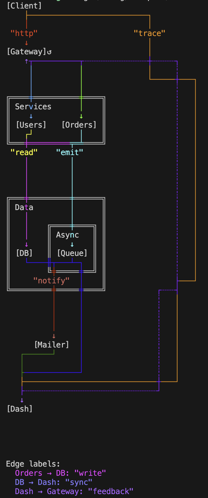
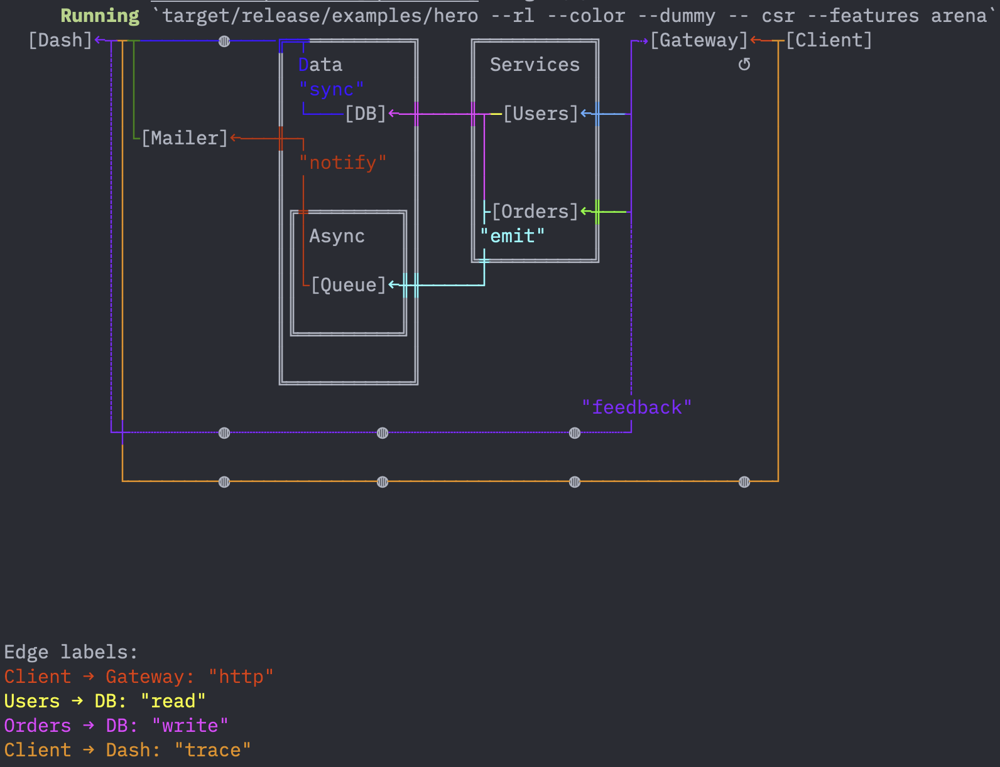
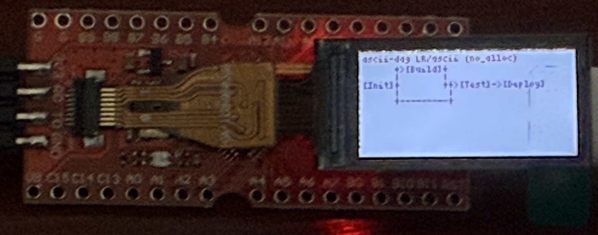

# ascii-dag

[](https://crates.io/crates/ascii-dag)
[](https://docs.rs/ascii-dag)
[](LICENSE)

A DAG layout engine that renders to text: Sugiyama-style layered
layout (cycle breaking, layering, crossing reduction, edge routing)
with a terminal renderer. The layout pipeline accepts cyclic input —
`compute_layout()` reverses back edges internally and renders them as
dashed return lines, so state machines and feedback graphs draw as
naturally as trees (the legacy `Graph::render()` keeps its
cycle-banner behavior instead). Zero dependencies. `no_std` + no-alloc
ready — the arena pipeline runs without a heap allocator.



It is for showing a graph *where the user already is*: a build tool
explaining why a task ran, a package manager drawing a dependency
diamond, a CI log annotating a failed pipeline, an embedded console
with a 160×80 display and no framebuffer. Anywhere a picture would
help but opening one is not an option.

Because the layout is separable from the painting, it also works as a
plain layout engine — `compute_layout()` hands back positioned nodes
and routed edges you can draw with Canvas, SVG, or your own widget.

| | ascii-dag | petgraph | Graphviz |
|---|---|---|---|
| For | drawing, in a terminal | graph algorithms | drawing, as an image |
| Dependencies | none | a few | a C toolchain |
| Layout engine | built in | none | built in, far richer |
| WASM | ~94–200 KB | ~30 KB | 2 MB+ |

Reach for `petgraph` when you need shortest paths and flows, and
Graphviz when you need publication-quality images. Reach for this when
the output has to be text.

## Example

```rust
use ascii_dag::{Graph, AUTO, RenderOptions};

let mut g = Graph::new();
let fetch  = g.add_node(AUTO, "Fetch");
let build  = g.add_node(AUTO, "Build");
let test   = g.add_node(AUTO, "Test");
let deploy = g.add_node(AUTO, "Deploy");
g.add_edge(fetch, build, None);
g.add_edge(fetch, test, None);
g.add_edge(build, deploy, None);
g.add_edge(test, deploy, Some("gate"));

// Heap path:
println!("{}", g.compute_layout().render_string(&RenderOptions::plain()));
```

```text
          [Fetch]
         ┌───┴─────┐
         ↓         ↓
      [Build]   [Test]
         └────┬────┘
           "gate"
              ↓
          [Deploy]
```

The same graph through the arena/no-alloc pipeline (`--features
arena`) — byte-identical output:

```rust
use ascii_dag::LayoutConfig;
use ascii_dag::graph::arena::Arena;

let mut csr_buf = vec![0u8; g.estimate_csr_arena_size()];
let mut csr_arena = Arena::new(&mut csr_buf);
let csr = g.to_csr(&mut csr_arena).unwrap();

let mut temp = vec![0u8; g.estimate_layout_arena_size()];
let mut out = vec![0u8; g.estimate_layout_arena_size()];
let (mut ta, mut oa) = (Arena::new(&mut temp), Arena::new(&mut out));
let ir = csr.compute_layout_arena(&LayoutConfig::standard(), &mut ta, &mut oa).unwrap();
println!("{}", ir.render_string(&RenderOptions::plain()));
```

On embedded targets the buffers are static arrays and
`render_to_bytes` writes into a caller buffer — no allocation
anywhere. See `examples/lean_render.rs`.

## Usage

### Nodes

The content slot of `add_node` decides what a node *is*:

```rust
g.add_node(1, "Client");                          // [Client]
g.add_node(2, BoxedNode("Database"));             // boxed label
g.add_node(3, CustomNode {                        // your painter + data
    label: "Server", width: 12, height: 5,
    painter: Some(card), payload: "cpu: 4\nram: 16G",
});
```

Ids: explicit (`add_node(7, …)`, for graphs built from external
identities — edges auto-create missing endpoints) or `AUTO`
(graph-assigned; returns a `NodeId` handle usable anywhere an id is
accepted). Re-adding an existing id replaces that node.
Details: [docs/nodes.md](docs/nodes.md).

### Subgraphs (clusters)

```rust
let sg = g.add_subgraph("Services");
g.put_nodes(&[a, b]).inside(sg)?;      // handles or raw ids
g.put_subgraphs(&[inner]).inside(sg)?; // nesting (cycle-checked)
```

### Cycles

A cycle does not break rendering — the offending edges are reversed
internally and drawn dashed, so you still get a picture. To check
first:

```rust
if g.has_cycle() { /* Graph::render prints a cycle banner instead */ }
```

Cycle detection also works over **your own types**, with no `Graph`
involved — handy for validating a config or build plan before
anything is laid out:

```rust
use ascii_dag::algorithms::cycles::generic::detect_cycle_fn;

let cycle = detect_cycle_fn(&["app", "lib", "core"], |id| match *id {
    "app" => vec!["lib"], "lib" => vec!["core"], "core" => vec!["app"], _ => vec![],
});
assert!(cycle.is_some());
```

`has_cycle_fn` is the boolean form; `topological_sort_fn` (at
`algorithms::generic`) returns an order or the cycle that prevents one.
Both modules need the `generic` feature, on by default.

### Ports

An edge can say which side of a node it leaves from and which side it
arrives on:

```rust
use ascii_dag::PortSide;

g.add_edge(service, audit, Some("trail")).from_port(PortSide::Clockwise);
g.add_edge(gateway, cache, None).to_port(PortSide::West);
g.add_edge(client, store, None).to_port(PortSide::Downstream);
```

Three vocabularies name a side: the compass (`North` / `East` /
`South` / `West`, fixed on the page), the flow (`Upstream` is the face
edges arrive on, `Downstream` the face they leave by), and rotations
of the flow (`Clockwise` is the traveler's right hand facing
downstream, `Counterclockwise` the left). Flow and rotation sides
follow the direction, so a graph declared once reads the same way in
`LR` as in `TB`:

| Side | `TB` | `BT` | `LR` | `RL` |
|---|:---:|:---:|:---:|:---:|
| `Upstream` | N | S | W | E |
| `Downstream` | S | N | E | W |
| `Clockwise` | W | E | S | N |
| `Counterclockwise` | E | W | N | S |

`Auto` (the default) is the head-on rule: leave `Downstream`, arrive
`Upstream`. A face has one port by default, shared by every edge
declared on it — the drawing `Auto` fan-ins already have; a port
policy (`set_port_policy` for the graph, `set_node_port_policy` for
a node) chooses `Paired` (an arrival and a departure port), `Spread`
(up to a bound) or `Custom` (your `fn`) instead. A node is never
widened for its ports. Every IR edge reports
the side each end asked for and the side it got (`from_port` /
`to_port`), and a side that could not be honored is a warning on the
run (see the table under *Errors and warnings*). The drawing rules and
the no-alloc form: [docs/ports.md](docs/ports.md); runnable:
`examples/ports.rs`.

### Render settings (`RenderOptions`)

Options live in three homes by what they affect: `plan` (resolved
semantics), `emit` (how they are written), `compose` (memory only).

| Field | Values | Default |
|---|---|---|
| `emit.charset` | `Unicode` / `Ascii` (equal projections of one canvas) | `Unicode` |
| `emit.color_mode` | `None` / `Ansi256` / `TrueColor` | `None` |
| `emit.render_legend` | print the legend block after the diagram | off |
| `plan.palette` | ANSI palette for edge coloring | `Ansi` |
| `plan.label_policy` | `placement`: `Geometric` / `AvoidNodeRows`; `overflow`: `Omit` / `Legend` | geometric, omit |
| `plan.show_dummy_nodes` | draw `◍` at routing waypoints | off |
| `plan.edge_style_fn` / `.subgraph_style_fn` / `.edge_label_style_fn` | per-element style callbacks (plain `fn`) | legacy look |
| `compose.band_rows_cap` | banded rendering: canvas memory = `width × cap` | 64 |

Presets: `RenderOptions::plain()`, `::colored(palette)`, `::ascii()`,
`::ascii_colored()`. Render surfaces on both IR types:
`render_string`, `render_with(&options, &mut impl fmt::Write)`
(streaming), `render_to_bytes` (no-alloc). Introspection lives on
`Scene` (`ScenePlanner::plan` + `scene.hit_test(x, y)`).

### Layout settings

```rust
g.set_direction(Direction::LeftRight);   // TB (default), BT, LR, RL
let mut config = LayoutConfig::standard();
config.node_spacing = 4;                 // gap between nodes within a level
config.level_spacing = 1;                // extra gap between levels
config.include_dummy_nodes = true;       // emit routing waypoints into the IR
```

All four directions lay out natively. `TB`/`BT` stack levels as rows;
`LR`/`RL` make them columns, which suits graphs with **many levels** —
a long pipeline is tall and scrolls in `TB`, but spends the terminal's
width in `LR`:

```text
TB (default)          LR
                                       ┌→[Store]
  [Fetch]                   "raw"      │
     │ "raw"          [Fetch]──→[Parse]┤
     ↓                                 │
  [Parse]                              └→[Index]
   ┌─┴──┐
   ↓    ↓
[Store] [Index]
```



*The hero example under `--rl --dummy --color`: levels run right to
left and `◍` marks each routing waypoint.*

`BT` and `RL` are exact mirrors of `TB` and `LR`. The spacing settings
follow the direction — `node_spacing` separates nodes within a level,
`level_spacing` separates levels — so the same config reads sensibly
whichever way the graph flows.

Crossing-reduction presets `FAST` / `STANDARD` / `QUALITY` (or a
custom `CrossingReducer` pipeline) via `set_crossing_pipeline`. Full
reference: [docs.rs/ascii-dag](https://docs.rs/ascii-dag).

### Feature flags

| Feature | Default | What it enables |
|---------|:---:|---|
| `std` | ✓ | standard library (implies `alloc`) |
| `alloc` | via `std` | heap `Graph` API on `no_std` (needs a global allocator) |
| `generic` | ✓ | cycle detection / toposort / impact analysis over your own types |
| `arena` | | CSR + arena layout pipeline (no-alloc capable) |
| `arena-idx-u8` / `-u16` / `-u32` | | index width: 255 / 65,535 / 4B nodes, with 16 / 16 / 32-bit cell coordinates (RAM tradeoff) |
| `ports` | ✓ | side ports: declared attachment sides on edges (`from_port` / `to_port`); off, nothing of it is linked |

Typical configurations: default (`ascii-dag = "0.10"`) for the heap
API; `default-features = false, features = ["arena"]` for no-alloc
embedded; add `arena` to defaults for the fast arena pipeline with
the ergonomic `Graph` builder. For WASM, `arena` alone keeps the
bundle around 94 KB (41 KB gzipped) against 200 KB for the default
build — see [BENCHMARK.md](BENCHMARK.md) for how that is measured.



*The arena pipeline on a Longan Nano (RISC-V, 32 KB RAM, no
allocator): `LeftRight` and the ASCII charset, because the LCD font
has no box-drawing glyphs. Firmware is 92 KB; the graph costs ~10 KB
of stack. It builds without the `ports` feature. See
`examples/longan_nano`.*

## Errors and warnings

Fallible operations return `GraphError`; every variant carries a
diagnostic code via `.code()` and an actionable `.hint()`:

| Variant | Code | Meaning |
|---|---|---|
| `EmptyGraph` | `E.Graph.Node.001` | no nodes to lay out |
| `NodeNotFound` / `SubgraphNotFound` | `E.Graph.Node.021` / `E.Graph.Subgraph.021` | referenced id absent |
| `CycleDetected` / `SubgraphCycle` | `E.Graph.Dag.003` / `E.Graph.Subgraph.003` | DAG / nesting constraint violated |
| `ArenaOom` / `BuilderFailed` | `E.ArenaLayout.Alloc.026` / `…Builder.026` | arena too small — size with `estimate_layout_arena_size` |
| `ExceedsMaxNodes` / `ExceedsMaxLevels` / `ExceedsMaxExtent` | `E.ArenaLayout.Node.004` / `…Level.004` / `…Extent.004` | index-type or coordinate-type capacity exceeded |
| `RenderPlanOom` / `RenderCanvasTooSmall` / `RenderOutputTooSmall` | `E.Render.{Plan,Canvas,Sink}.026` | render buffer too small — size with `estimate_render_*` |

Non-fatal events are typed diagnostics: collect them with a
`DiagnosticRun` through the diagnostic-aware entry points
(`graph.layout().compute(&mut cx)` / `.reported()`,
`planner.plan(&ir, &opts).compute(&mut cx)`) — the library never
writes to stderr:

| Code | Fires when | Channel |
|---|---|---|
| `W.Graph.Node.021` | the graph still holds implicit auto-created placeholders (a standing condition, reported per run until fixed) | diagnostics channel |
| `W.Graph.Dag.003` | the current `crossing_reduction_passes` value was clamped (condition — cleared by a sane value) | diagnostics channel |
| `W.Graph.Dag.033` | the current `crossing_reduction_passes` value is kept but past useful range | diagnostics channel |
| `W.Render.Label.031` | an edge label fits nowhere inline and the legend is off — it will not be rendered | diagnostics channel |
| `W.Graph.Port.034` | a declared side on a self-loop is not honored yet — the loop keeps its marker | diagnostics channel |
| `W.Graph.Port.035` | a declared side could not be routed (no room beside the node) — the end attached head-on | diagnostics channel |

Point events are receipts at the call site instead: `add_edge` returns
`EdgeInsertion` (did an endpoint get auto-created?), `add_node` returns
`NodeInsertion` (did this replace a node — with `AUTO` involved?).

## Documentation

- [docs/layout.md](docs/layout.md) — directions, clusters, spacing, crossing reduction, reading the IR
- [docs/rendering.md](docs/rendering.md) — options, styling, streaming, no-alloc output, hit-testing
- [docs/nodes.md](docs/nodes.md) — nodes as objects: painters, payloads, blank nodes
- [docs/ports.md](docs/ports.md) — side ports: the side vocabulary, how a side is drawn, attachments, warnings
- [docs/migrate-from-0.9.md](docs/migrate-from-0.9.md) — upgrading to 0.10
- [examples/README.md](examples/README.md) — 20 runnable examples; the rendering ones take `--csr` to show the arena pipeline
- [BENCHMARK.md](BENCHMARK.md) — measured performance, desktop and embedded
- [ARCHITECTURE.md](ARCHITECTURE.md) — how the pipeline works

## Limitations

Text-grid output: edges route orthogonally (no diagonals), wide
Unicode in labels counts as one cell per `char`, and layouts optimize
for readability rather than minimal area. Very dense graphs (hundreds
of edges crossing one level) reach a point where any text grid stops
being readable — that is a property of the medium, not the layout.

## License

Licensed under either of:

- Apache License, Version 2.0 ([LICENSE-APACHE](LICENSE-APACHE) or http://www.apache.org/licenses/LICENSE-2.0)
- MIT license ([LICENSE-MIT](LICENSE-MIT) or http://opensource.org/licenses/MIT)

at your option.

## Versioning and releases

While the crate is pre-1.0, each **minor** version is a compatibility
line: `0.10 → 0.11` may break, `0.10.0 → 0.10.3` will not.

Each minor line lives on its own long-running branch — `release/v0.10`,
`release/v0.11` — and patch releases are tagged on it. There is no
branch per patch: `0.10.1`, `0.10.2` and so on are tags along
`release/v0.10`, which is what makes it possible to ship a fix for
0.10 after `main` has moved on to 0.11.

Pin to a line and you get its fixes without surprises:

```toml
ascii-dag = "0.10"     # 0.10.x, including later patch fixes
```

## Contribution

Contributions welcome! This project aims to stay small and focused.

Fixes land on `main` first, then get backported to the release
branches that need them — that way a bug fixed in a patch cannot
reappear in the next minor.

---

Created by [Ash](https://github.com/AshutoshMahala)
